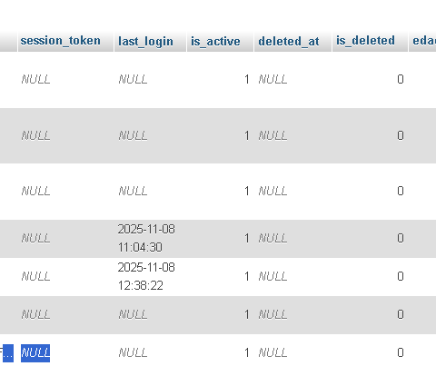
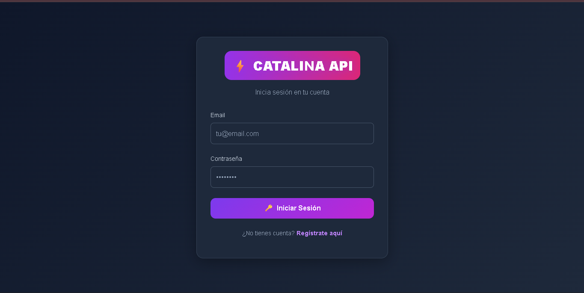
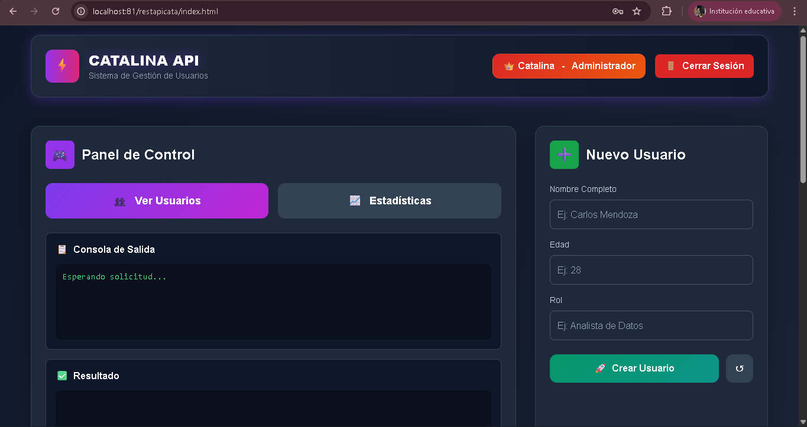
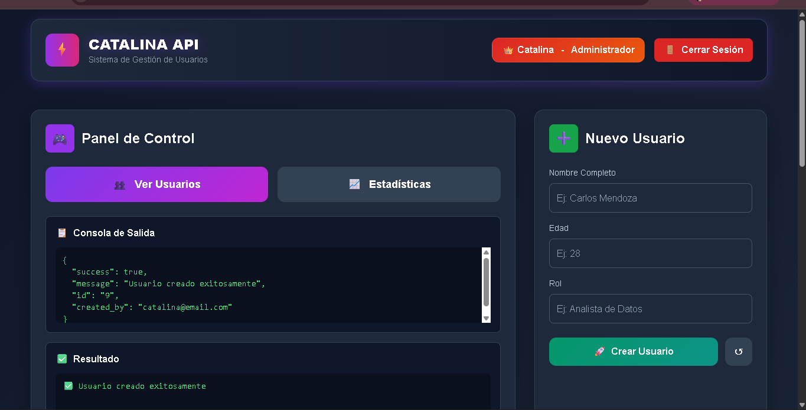
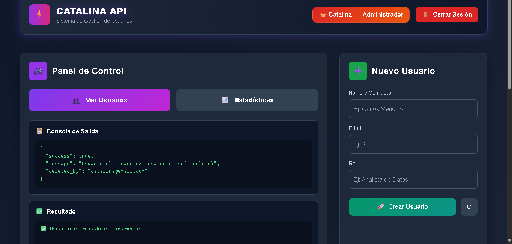
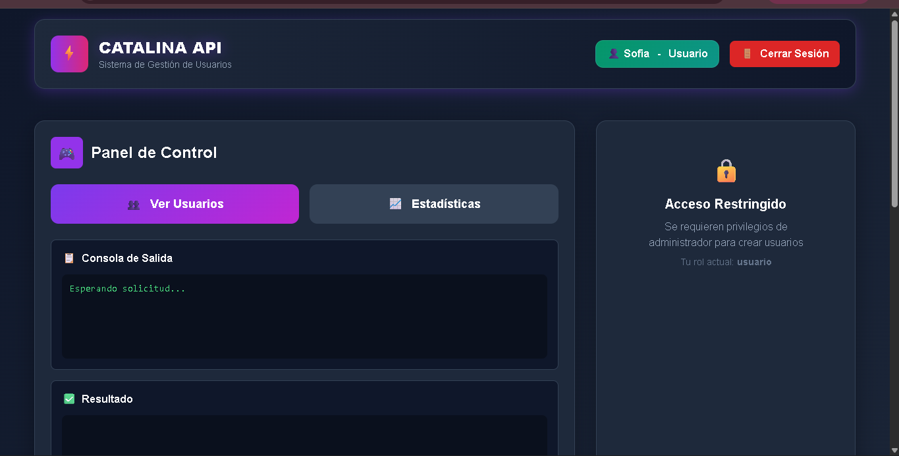
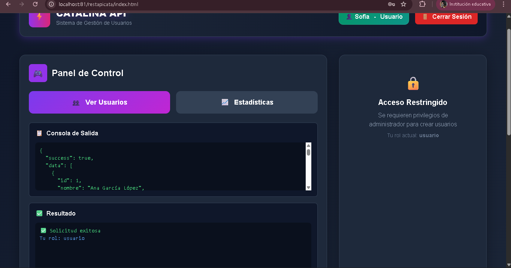
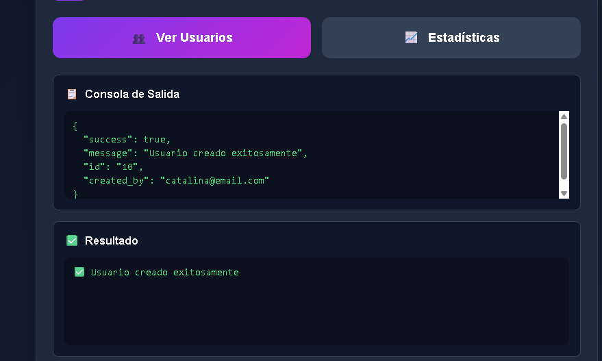
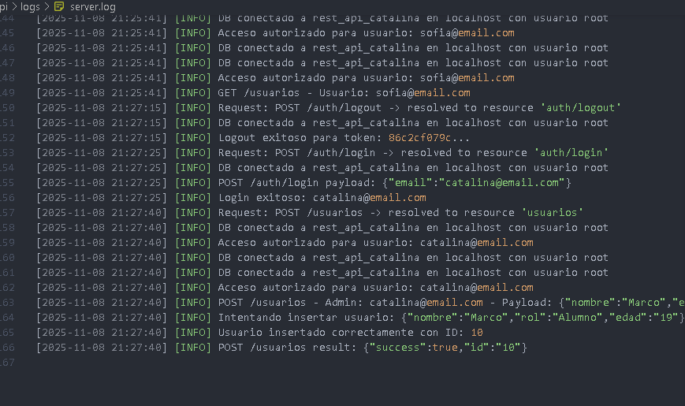

# API REST Catalina - Sistema de Gestión de Usuarios

## 🎯 Objetivo General

Desarrollar un **Sistema de Gestión de Usuarios con API REST** completo, modular y seguro que demuestre competencias en desarrollo full-stack con autenticación basada en tokens, autorización por roles, operaciones CRUD con soft delete, manejo de sesiones activas y logging de actividades.

---


## ⚙️ Instalación y Ejecución

### Prerrequisitos
- XAMPP con Apache y MySQL
- Navegador web moderno
- Acceso a la carpeta `htdocs` de XAMPP

### Paso 1: Configuración de Base de Datos

```sql
-- Crear base de datos
CREATE DATABASE rest_api_catalina;
USE rest_api_catalina;

-- Crear tabla de usuarios
CREATE TABLE usuarios (
    id INT AUTO_INCREMENT PRIMARY KEY,
    nombre VARCHAR(100) NOT NULL,
    email VARCHAR(100) UNIQUE NOT NULL,
    password_hash VARCHAR(255) NOT NULL,
    edad INT NOT NULL,
    rol VARCHAR(50) NOT NULL DEFAULT 'usuario',
    session_token VARCHAR(255) NULL,
    last_login TIMESTAMP NULL,
    is_active BOOLEAN DEFAULT true,
    created_at TIMESTAMP DEFAULT CURRENT_TIMESTAMP,
    deleted_at TIMESTAMP NULL,
    is_deleted BOOLEAN DEFAULT false
);

-- Crear índices para optimización
CREATE INDEX idx_email ON usuarios(email);
CREATE INDEX idx_session_token ON usuarios(session_token);
```

### Paso 2: Colocar el Proyecto

1. Descargar/clonar el proyecto
2. Colocar la carpeta `restapicata` en `C:/xampp/htdocs/`

### Paso 3: Verificar Configuración PHP

En `api/config/db.php`, verificar:
```php
private $host = "localhost";
private $db_name = "rest_api_catalina"; 
private $username = "root";
private $password = "";
```

En `login.html` e `index.html`, verificar:
```javascript
const API_BASE_URL = 'http://localhost:81/restapicata/api';
```

### Paso 4: Ejecutar

1. **Iniciar XAMPP**: Apache + MySQL
2. **Abrir en navegador**: `http://localhost:81/restapicata/login.html`
3. **Registrar usuario** o usar credenciales de prueba
4. **Establecer roles** en la base de datos:
```sql
UPDATE usuarios SET rol = 'administrador' WHERE email = 'tu@email.com';
UPDATE usuarios SET rol = 'usuario' WHERE email = 'otro@email.com';
```

---

## 📋 Funcionamiento del Sistema

### Autenticación y Sesiones

**Flujo de Login:**
1. Usuario ingresa email y contraseña
2. Backend valida credenciales contra `password_hash`
3. Si son válidas, genera token aleatorio de 64 caracteres hexadecimales
4. Token se almacena en BD y en localStorage del navegador
5. Token se incluye en header `Authorization: Bearer {token}` en cada request

**Validación de Token:**
- Cada request protegido pasa por `AuthMiddleware::authenticate()`
- Middleware verifica que el token exista en la BD y pertenezca a usuario activo
- Si token es inválido o expiró, retorna 401 Unauthorized

### Operaciones CRUD Implementadas

| Método | Endpoint | Autenticación | Rol Requerido |
|--------|----------|-----------------|--------------|
| GET | `/usuarios` | Sí | Cualquiera |
| GET | `/usuarios/{id}` | Sí | Cualquiera |
| POST | `/usuarios` | Sí | Administrador |
| PATCH | `/usuarios` | Sí | Administrador |
| DELETE | `/usuarios` | Sí | Administrador |

**Soft Delete Implementado:**
```php
// En UsuariosController::delete()
$stmt = $this->db->prepare("UPDATE usuarios SET is_deleted = true, deleted_at = NOW() WHERE id = :id");
$stmt->execute([':id' => $id]);
```

Los usuarios eliminados no se borran físicamente, solo se marcan como `is_deleted = true`. Las consultas siempre filtran estos registros.

### Sistema de Roles

**Administrador** (rol = 'administrador')
- Acceso completo a CRUD
- Ver y gestionar todos los usuarios
- Acceso a estadísticas

**Usuario/Estudiante** (rol = 'usuario')
- Solo ver lista de usuarios (GET)
- No puede crear, modificar ni eliminar

**Desarrollador** (rol = 'desarrollador')
- Ver usuarios
- Crear nuevos usuarios
- Sin acceso a eliminar

---

## 🔒 Seguridad y Validación

### Validación Multinivel

**Frontend (JavaScript):**
```javascript
// Validación de nombre - solo letras y espacios
const nameRegex = /^[\p{L}\s]+$/u;
if (!nameRegex.test(nombre)){
    errorElement.textContent = 'Nombre inválido: use solo letras y espacios.';
    return;
}
```

**Backend (PHP):**
```php
// Validación idéntica en servidor
if (!preg_match('/^[\p{L}\s]+$/u', $nombre)) {
    http_response_code(400);
    echo json_encode(['success' => false, 'error' => 'Nombre solo puede contener letras y espacios']);
    return;
}
```

### Protección contra SQL Injection

Todos los queries usan **prepared statements** con parámetros vinculados:
```php
// ✅ SEGURO
$stmt = $this->db->prepare("SELECT * FROM usuarios WHERE email = :email");
$stmt->execute([':email' => $email]);

// ❌ NUNCA HACER
$stmt = $this->db->query("SELECT * FROM usuarios WHERE email = '$email'");
```

### Hash de Contraseñas

- **Registro**: Contraseña se hashea con bcrypt
```php
$password_hash = password_hash($password, PASSWORD_DEFAULT);
```

- **Login**: Verificación segura
```php
if (password_verify($password, $user['password_hash'])) {
    // Credenciales válidas
}
```

---

## 📊 Logs y Auditoría

El sistema registra automáticamente toda actividad en `logs/server.log`:

```
[2024-01-15 10:30:45] [INFO] DB conectado a rest_api_catalina en localhost
[2024-01-15 10:31:20] [INFO] Login exitoso: catalina@email.com
[2024-01-15 10:32:15] [WARN] Intento de acceso sin token de autenticación
[2024-01-15 10:33:00] [ERROR] Error al crear usuario - SQL Error: UNIQUE constraint failed
```

**Eventos Registrados:**
- Conexiones/desconexiones a BD
- Intentos de login (exitosos y fallidos)
- Accesos autorizados y denegados
- Operaciones CRUD
- Errores del sistema

---

## 🛡️ Endpoints de la API

### Públicos (sin autenticación)

```
POST /auth/register
Cuerpo: { nombre, email, password, edad, rol }

POST /auth/login
Cuerpo: { email, password }
Respuesta: { token, user: {id, nombre, email, rol} }

GET /auth/verify
Descripción: Verifica si el token actual es válido

GET /stats
Descripción: Estadísticas generales del sistema
```

### Protegidos (requieren token)

```
GET /usuarios
Descripción: Lista todos los usuarios (sin soft deleted)
Respuesta: [{ id, nombre, email, rol, edad, created_at }, ...]

GET /usuarios/{id}
Descripción: Obtiene usuario específico

POST /usuarios
Requiere: rol = administrador
Cuerpo: { nombre, edad, rol }

PATCH /usuarios
Requiere: rol = administrador
Cuerpo: { id, nombre?, edad?, rol? }

DELETE /usuarios
Requiere: rol = administrador
Cuerpo: { id }
Efecto: Soft delete (marca como eliminado)

POST /auth/logout
Descripción: Invalida el token actual
```

---

## 🖼️ Capturas del Funcionamiento

### 1. Base de Datos - Estructura


**Descripción**: Estructura de la tabla en phpMyAdmin con todos los campos necesarios para el sistema.

---

### 2. Base de Datos - Registros y Soft Delete



**Descripción**: Usuarios registrados mostrando:
- Múltiples usuarios con diferentes roles
- Demostración de soft delete: `is_deleted = 1` con `deleted_at` como timestamp
- Los datos se marcan como eliminados pero nunca se borran físicamente

---

### 3. Login - Formulario de Autenticación



**Descripción**: Página de autenticación con:
- Logo "⚡ CATALINA API"
- Campos de Email y Contraseña
- Validación en tiempo real
- Opción para registrarse

---

### 4. Panel de Administración - Vista Completa



**Descripción**: Index.html como administrador mostrando:
- Header con badge rojo "👑 Administrador"
- Acceso completo a todos los formularios CRUD
- Panel de control con opciones de gestión

---

### 5. CRUD - Crear Usuario



**Descripción**: Formulario de creación:
- Campos: Nombre, Edad, Rol
- Validación de datos en frontend
- Botón "🚀 Crear Usuario" para enviar al backend

---

### 6. Soft Delete - Eliminación en Base de Datos



**Descripción**: Resultado de operación DELETE:
- Usuario marcado como `is_deleted = 1`
- Campo `deleted_at` con timestamp actual
- Comprueba que NO se elimina físicamente

---

### 7. Control de Acceso por Roles - Usuario Bloqueado



**Descripción**: Index.html como usuario normal mostrando:
- Badge verde "👤 Usuario"
- Secciones bloqueadas con icono 🔒
- Mensaje: "Se requieren privilegios de administrador"
- Demostración de autorización por roles

---

### 8. API - Respuesta GET /usuarios



**Descripción**: Respuesta JSON exitosa:
```json
{
  "success": true,
  "data": [...usuarios...],
  "count": 2,
  "user_role": "administrador"
}
```

---

### 9. API - Respuesta POST /usuarios



**Descripción**: Respuesta de creación exitosa:
```json
{
  "success": true,
  "message": "Usuario creado exitosamente",
  "id": 5,
  "created_by": "admin@email.com"
}
```

---

### 10. Logs de Actividad del Sistema



**Descripción**: Archivo `logs/server.log` mostrando auditoría completa:
- Conexiones a BD
- Intentos de login
- Operaciones CRUD
- Accesos denegados
- Errores del sistema
- Cada evento con fecha, hora y tipo [INFO], [WARN], [ERROR]

---

## 🔑 Autenticación Técnica Explicada

### Generación de Token
```php
// En AuthController::login()
$token = bin2hex(random_bytes(32)); // 64 caracteres seguros
$this->model->updateSessionToken($user['id'], $token);
```

- `random_bytes(32)` genera 32 bytes criptográficamente seguros
- `bin2hex()` convierte a 64 caracteres hexadecimales legibles
- Se almacena en la BD y en localStorage del cliente

### Validación de Token en cada Request
```php
// En AuthMiddleware::authenticate()
$token = self::extractToken($authHeader); // Extrae de "Bearer {token}"
$user = $userModel->getUserBySessionToken($token); // Valida en BD

if (!$user) {
    self::sendUnauthorized("Token inválido o sesión expirada");
}
```

### Cierre de Sesión
```php
// En AuthController::logout()
$this->model->invalidateSessionToken($token);
// UPDATE usuarios SET session_token = NULL WHERE session_token = :token
```

El token se marca como NULL en BD, invalidando la sesión.


---

## 📁 Estructura de Archivos Clave

### `api/routes.php`
Router principal que mapea URLs a controladores:
```php
case $resource === 'usuarios' && $method === 'GET' && !$userId:
    AuthMiddleware::authenticate();
    $controller = new UsuariosController();
    $controller->getAll();
    break;
```

### `api/middleware/AuthMiddleware.php`
Valida autenticación y autorización:
```php
public static function requireAdmin() {
    $user = self::authenticate();
    if ($user['rol'] !== 'administrador') {
        http_response_code(403);
        echo json_encode(['error' => 'Acceso denegado']);
        exit;
    }
    return $user;
}
```

### `api/models/Usuarios.php`
Métodos CRUD y de autenticación:
```php
public function validateCredentials($email, $password) {
    $stmt = $this->db->prepare("SELECT * FROM usuarios WHERE email = :email");
    $stmt->execute([':email' => $email]);
    $user = $stmt->fetch();
    
    if ($user && password_verify($password, $user['password_hash'])) {
        return $user;
    }
    return false;
}
```

---

## 🧪 Pruebas Básicas

### 1. Registrar Usuario
```
POST http://localhost:81/restapicata/api/auth/register
Content-Type: application/json

{
  "nombre": "Ana García",
  "email": "ana@email.com",
  "password": "123456",
  "edad": 25,
  "rol": "usuario"
}
```

### 2. Login
```
POST http://localhost:81/restapicata/api/auth/login
Content-Type: application/json

{
  "email": "ana@email.com",
  "password": "123456"
}

Respuesta: { token: "abc123...", user: {...} }
```

### 3. Ver Usuarios (con token)
```
GET http://localhost:81/restapicata/api/usuarios
Authorization: Bearer abc123...
```

### 4. Crear Usuario (solo admin)
```
POST http://localhost:81/restapicata/api/usuarios
Authorization: Bearer admin_token...
Content-Type: application/json

{
  "nombre": "Luis López",
  "edad": 30,
  "rol": "desarrollador"
}
```

### 5. Eliminar Usuario (soft delete)
```
DELETE http://localhost:81/restapicata/api/usuarios
Authorization: Bearer admin_token...
Content-Type: application/json

{ "id": 2 }
```

---

## 🚀 Características Implementadas

✅ **API REST modular** con separación de responsabilidades  
✅ **CRUD completo** con soft delete  
✅ **Autenticación con tokens** de sesión  
✅ **Autorización por roles** (Admin, Usuario, Desarrollador)  
✅ **Validación multinivel** (frontend + backend)  
✅ **Protección contra SQL Injection** (prepared statements)  
✅ **Hash seguro de contraseñas** (bcrypt)  
✅ **Logging centralizado** de eventos y errores  
✅ **CORS configurado** para desarrollo  
✅ **Interfaz adaptativa** según permisos del usuario  

---

## 🔗 Repositorio

**GitHub**: [Enlaza tu repositorio GitHub aquí]
